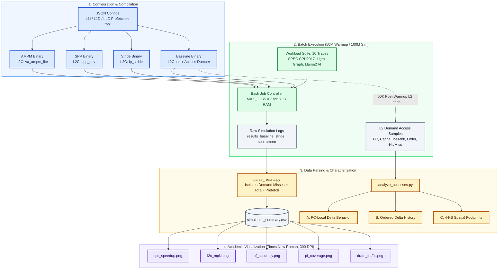

# ChampSim L2 Cache Prefetcher Evaluation

This repository contains the experimental pipeline, configuration files, and analysis scripts used to evaluate L2 cache prefetchers in ChampSim. The study compares a no-prefetch baseline against three L2 prefetcher designs—Stride (`ip_stride`), Signature Path Prefetcher (`spp_dev`), and Access Map Pattern Matching (`va_ampm_lite`)—across SPEC CPU2017, Ligra graph analytics, and Llama2 AI workload traces.

## Project Overview

- **Simulator:** ChampSim
- **Workloads:** SPEC CPU2017 (`603.bwaves`, `605.mcf`, `619.lbm`, `620.omnetpp`, `623.xalancbmk`, `649.fotonik3d`), Ligra graph kernels (`ligra_BFSCC`, `ligra_PageRankDelta`, `ligra_Triangle`), and AI inference (`llama2.c-stories15M`)
- **Simulation length:** 50M warmup instructions, 100M simulated instructions
- **Hardware target:** macOS on Apple Silicon with 8 GB unified memory
- **L1D / LLC prefetching:** Disabled (`"no"`) across all configurations to strictly isolate L2 cache prefetcher behavior

---

## Experimental Workflow



---

## 1. Environment Setup

ChampSim depends on the native macOS `clang++` / `g++` toolchain. If you are using Miniconda or Anaconda, avoid using the Conda-provided C++ compiler because it triggers header failures related to `from_chars_floating_point.h`. Additionally, ensure the Xcode Command Line Tools license is accepted if macOS recently updated Xcode.

Before building the simulator, run:

```bash
conda deactivate
sudo xcodebuild -license accept
make clean
```

## 2. Build the Simulator
The project includes four prefetcher configurations, each defined by a JSON config and built into a separate binary in the `bin/` directory.

### 2.1 Baseline (No Prefetching)
Bash

```
./config.sh baseline_config.json
make
```

### 2.2 Stride Prefetcher (`ip_stride`)
Bash

```
./config.sh stride_config.json
make
```

### 2.3 SPP Prefetcher (`spp_dev`)
Bash

```
./config.sh spp_config.json
make
```

### 2.4 AMPM Prefetcher (`va_ampm_lite`)
Bash

```
./config.sh ampm_config.json
make
```

All successful builds are stored under the `bin/` directory.

## 3. Run Simulations
To avoid memory pressure and excessive swapping on an 8 GB host, the provided shell scripts run simulations with a limited concurrency level (`MAX_JOBS=3`).

Make the scripts executable:

Bash

```
chmod +x run_baseline.sh run_stride.sh run_spp.sh run_ampm.sh
```

Run each batch sequentially (do not execute them in parallel):

Bash

```
./run_baseline.sh
./run_stride.sh
./run_spp.sh
./run_ampm.sh
```

Simulation outputs are written to their respective `results_<config>/` directories.

## 4. Extract Results & Compute Metrics
After the simulation runs finish, extract the raw ChampSim output into a structured CSV summary:

Bash

```
python3 parse_results.py
```

This generates `simulation_summary.csv` using the following metric definitions:

- **L2C Demand Misses:** `L2C TOTAL MISS - L2C PREFETCH MISS` (isolating core demand misses from speculative prefetch traffic)
- **L2C MPKI:** `L2C Demand Misses / (Instructions / 1000)`
- **Coverage (%):** `((Baseline L2C Demand Misses - Prefetch L2C Demand Misses) / Baseline L2C Demand Misses) * 100`
- **Accuracy (%):** `(PF_Useful / (PF_Useful + PF_Useless)) * 100`
- **IPC Speedup:** `IPC_prefetch / IPC_baseline`
- **Normalized DRAM Traffic:** Total DRAM channel row-buffer hits and misses (RQ + WQ), normalized to the baseline configuration

## 5. Generate Visualizations
The repository includes plotting scripts built with `pandas` and `matplotlib` (configured with **Times New Roman** academic styling). These scripts automatically filter out incomplete runs and save high-resolution figures (300 DPI).

Run the visualization suite:

Bash

```
python3 plot_results.py
python3 plot_mpki.py
python3 plot_acc_cov.py
python3 plot_dram.py
```

The generated charts are saved in the `plots/` directory:

- `ipc_speedup.png`
- `l2c_mpki.png`
- `pf_accuracy.png`
- `pf_coverage.png`
- `dram_traffic.png`

## 6. Memory Access Characterization
To explain why each prefetcher succeeds or fails on specific workloads, the baseline L2 prefetcher hook (`prefetcher/no/no.cc`) is instrumented to dump a bounded post-warmup sample of 50,000 L2 demand load accesses (`AccessOrder, LoadPC, CacheLineAddr, Hit`).

The `analyze_accesses.py` script processes these samples to compute:

1. **PC-Local Delta Behavior:** Top L2-missing load PCs, their most frequent address stride, and dominant-delta fraction.
2. **Ordered Delta History:** Top recurring 4-step within-page delta sequences.
3. **Spatial Footprints:** 4-KB page cache-line density (`Unique Offsets / 64`) and repeating page bitmaps.
Run the characterization analysis on the collected samples:

Bash

```
python3 analyze_accesses.py sample_fotonik3d.csv
python3 analyze_accesses.py sample_bfscc.csv
python3 analyze_accesses.py sample_xalancbmk.csv
```

## 7. Expected Anomalies and Edge Cases

- **SPP Internal Assertion:** The `spp_dev` prefetcher triggers an internal assertion failure (`Abort trap: 6` in `update_entry()`, `spp_dev.cc:531`) on `ligra_PageRankDelta` and `llama2.c-stories15M` due to high-concurrency page thrashing in the prefetch filter.
- **Run-Window Exhaustion:** Incomplete runs on `603.bwaves`, `605.mcf`, and `619.lbm` under host memory limits are tagged as `Failed/Incomplete` by `parse_results.py` and excluded from normalized cross-prefetcher plots to maintain strict data integrity.

## 8. Quick Start
To reproduce the full workflow in order:

Bash

```
conda deactivate
make clean
./config.sh baseline_config.json && make
./config.sh stride_config.json && make
./config.sh spp_config.json && make
./config.sh ampm_config.json && make
chmod +x run_baseline.sh run_stride.sh run_spp.sh run_ampm.sh
./run_baseline.sh
./run_stride.sh
./run_spp.sh
./run_ampm.sh
python3 parse_results.py
python3 plot_results.py
python3 plot_mpki.py
python3 plot_acc_cov.py
python3 plot_dram.py
python3 analyze_accesses.py sample_fotonik3d.csv
python3 analyze_accesses.py sample_bfscc.csv
python3 analyze_accesses.py sample_xalancbmk.csv
```
